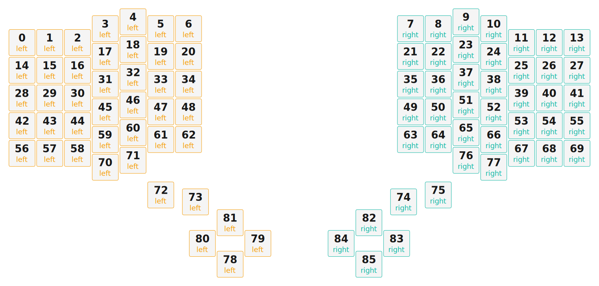

# ZMK Configuration for manuform_6x7

*Generated by Shield Wizard for ZMK*



Download compiled firmware from the Actions tab. <https://zmk.dev/docs/user-setup#installing-the-firmware>

Edit your keymap <https://zmk.dev/docs/keymaps>.
User keymap is located at [`config/manuform_6x7.keymap`](config/manuform_6x7.keymap).

-----

<details>
<summary>
Shield Wizard Debug Information
</summary>

In case of broken configuration, here is the Shield Wizard internal data used to generate this configuration:

Commit: 1bc308cbed65fac144201644c2075be718bdbf1f

```json
{"name":"manuform_6x7","shield":"manuform_6x7","dongle":false,"modules":[],"layout":[{"id":"01KKKWGX76DH8MWZEB3G6A89RR","part":0,"row":0,"col":0,"w":1,"h":1,"x":0,"y":0.75,"r":0,"rx":0,"ry":0},{"id":"01KKKWZ2TAJG1SXJA0RKSQT3K0","part":0,"row":0,"col":1,"w":1,"h":1,"x":1,"y":0.75,"r":0,"rx":0,"ry":0},{"id":"01KKKWZEKWKRFDV5CV649MFQFY","part":0,"row":0,"col":2,"w":1,"h":1,"x":2,"y":0.75,"r":0,"rx":0,"ry":0},{"id":"01KKKWZMR8VVRHVN3MYRBSBGHJ","part":0,"row":0,"col":3,"w":1,"h":1,"x":3,"y":0.25,"r":0,"rx":0,"ry":0},{"id":"01KKKWZN46JPPB5BFE7481JC1R","part":0,"row":0,"col":4,"w":1,"h":1,"x":4,"y":0,"r":0,"rx":0,"ry":0},{"id":"01KKKWZNEM2HEKW67372HVFF5S","part":0,"row":0,"col":5,"w":1,"h":1,"x":5,"y":0.25,"r":0,"rx":0,"ry":0},{"id":"01KKKWZNT3977X77S4H8S389T6","part":0,"row":0,"col":6,"w":1,"h":1,"x":6,"y":0.25,"r":0,"rx":0,"ry":0},{"id":"01KKKWZTK7CXHW2G4Z2TAJKC1K","part":1,"row":0,"col":10,"w":1,"h":1,"x":14,"y":0.25,"r":0,"rx":0,"ry":0},{"id":"01KKKWZTYP54V3PP6YQ9BHPBP1","part":1,"row":0,"col":11,"w":1,"h":1,"x":15,"y":0.25,"r":0,"rx":0,"ry":0},{"id":"01KKKWZV82186TSD77550XQAQD","part":1,"row":0,"col":12,"w":1,"h":1,"x":16,"y":0,"r":0,"rx":0,"ry":0},{"id":"01KKKWZVFB3NCATN7Z9C13TMSK","part":1,"row":0,"col":13,"w":1,"h":1,"x":17,"y":0.25,"r":0,"rx":0,"ry":0},{"id":"01KKKWZVNKMM6E3ZWQNW3XKMKQ","part":1,"row":0,"col":14,"w":1,"h":1,"x":18,"y":0.75,"r":0,"rx":0,"ry":0},{"id":"01KKKWZVWC49YQC6V5KK5BHVYF","part":1,"row":0,"col":15,"w":1,"h":1,"x":19,"y":0.75,"r":0,"rx":0,"ry":0},{"id":"01KKKWZW34RH8PBV6SRWRFW001","part":1,"row":0,"col":16,"w":1,"h":1,"x":20,"y":0.75,"r":0,"rx":0,"ry":0},{"id":"01KKKX075V0XGZD8BMY17KDZ6V","part":0,"row":1,"col":0,"w":1,"h":1,"x":0,"y":1.75,"r":0,"rx":0,"ry":0},{"id":"01KKKX1RP6P0SSQC9RDF8ZDC60","part":0,"row":1,"col":1,"w":1,"h":1,"x":1,"y":1.75,"r":0,"rx":0,"ry":0},{"id":"01KKKX1WEHR08JHY0QA4D4AHT4","part":0,"row":1,"col":2,"w":1,"h":1,"x":2,"y":1.75,"r":0,"rx":0,"ry":0},{"id":"01KKKX1WN9PFFF32YJ57VNS38D","part":0,"row":1,"col":3,"w":1,"h":1,"x":3,"y":1.25,"r":0,"rx":0,"ry":0},{"id":"01KKKX1WVH7PX638MV7KT6W3JR","part":0,"row":1,"col":4,"w":1,"h":1,"x":4,"y":1,"r":0,"rx":0,"ry":0},{"id":"01KKKX1X2AFVDDAAT99AXNV1NW","part":0,"row":1,"col":5,"w":1,"h":1,"x":5,"y":1.25,"r":0,"rx":0,"ry":0},{"id":"01KKKX1X9MFDZXSSK0R7G0ZB04","part":0,"row":1,"col":6,"w":1,"h":1,"x":6,"y":1.25,"r":0,"rx":0,"ry":0},{"id":"01KKKX1XGWZ7H6BY3BPAHDN7X9","part":1,"row":1,"col":10,"w":1,"h":1,"x":14,"y":1.25,"r":0,"rx":0,"ry":0},{"id":"01KKKX1XQMXRWM8MJ7EQ0S58CC","part":1,"row":1,"col":11,"w":1,"h":1,"x":15,"y":1.25,"r":0,"rx":0,"ry":0},{"id":"01KKKX1XYGB83DYR60V98T56TM","part":1,"row":1,"col":12,"w":1,"h":1,"x":16,"y":1,"r":0,"rx":0,"ry":0},{"id":"01KKKX1Y56SKPX3449VBDDGGM2","part":1,"row":1,"col":13,"w":1,"h":1,"x":17,"y":1.25,"r":0,"rx":0,"ry":0},{"id":"01KKKX1YBE1AXQHXZFQBE6AKS3","part":1,"row":1,"col":14,"w":1,"h":1,"x":18,"y":1.75,"r":0,"rx":0,"ry":0},{"id":"01KKKX1YHQQR3VBDCSBKGVDTXA","part":1,"row":1,"col":15,"w":1,"h":1,"x":19,"y":1.75,"r":0,"rx":0,"ry":0},{"id":"01KKKX1YQZY4Y6Y2854GN2NF4M","part":1,"row":1,"col":16,"w":1,"h":1,"x":20,"y":1.75,"r":0,"rx":0,"ry":0},{"id":"01KKKX3AQSS6T6SVJS2MDCRYX2","part":0,"row":2,"col":0,"w":1,"h":1,"x":0,"y":2.75,"r":0,"rx":0,"ry":0},{"id":"01KKKX45RWH2FXKPCMGT3M03NM","part":0,"row":2,"col":1,"w":1,"h":1,"x":1,"y":2.75,"r":0,"rx":0,"ry":0},{"id":"01KKKX46JCS0K6QMYAN3EGRJMH","part":0,"row":2,"col":2,"w":1,"h":1,"x":2,"y":2.75,"r":0,"rx":0,"ry":0},{"id":"01KKKX46TWMKC2QCADC8VRPPME","part":0,"row":2,"col":3,"w":1,"h":1,"x":3,"y":2.25,"r":0,"rx":0,"ry":0},{"id":"01KKKX46ZFNNTVTSJ3T9PDDCWP","part":0,"row":2,"col":4,"w":1,"h":1,"x":4,"y":2,"r":0,"rx":0,"ry":0},{"id":"01KKKX4742M8RFWM0EPKS2G4V9","part":0,"row":2,"col":5,"w":1,"h":1,"x":5,"y":2.25,"r":0,"rx":0,"ry":0},{"id":"01KKKX479EXWF4BPMQBTF5KNVG","part":0,"row":2,"col":6,"w":1,"h":1,"x":6,"y":2.25,"r":0,"rx":0,"ry":0},{"id":"01KKKX47E0Y9G92F2K8RN41H67","part":1,"row":2,"col":10,"w":1,"h":1,"x":14,"y":2.25,"r":0,"rx":0,"ry":0},{"id":"01KKKX47JP895JY2GR86R14ZVJ","part":1,"row":2,"col":11,"w":1,"h":1,"x":15,"y":2.25,"r":0,"rx":0,"ry":0},{"id":"01KKKX47QC87SD74YE46VVNEN4","part":1,"row":2,"col":12,"w":1,"h":1,"x":16,"y":2,"r":0,"rx":0,"ry":0},{"id":"01KKKX47WMJ76FEQTFV5B34BR1","part":1,"row":2,"col":13,"w":1,"h":1,"x":17,"y":2.25,"r":0,"rx":0,"ry":0},{"id":"01KKKX481SH42RFT5XZYCQMXKJ","part":1,"row":2,"col":14,"w":1,"h":1,"x":18,"y":2.75,"r":0,"rx":0,"ry":0},{"id":"01KKKX486M0NFT8EDF8QDS9XF5","part":1,"row":2,"col":15,"w":1,"h":1,"x":19,"y":2.75,"r":0,"rx":0,"ry":0},{"id":"01KKKX48GB85MAZW0Q28RSG8A9","part":1,"row":2,"col":16,"w":1,"h":1,"x":20,"y":2.75,"r":0,"rx":0,"ry":0},{"id":"01KKKX4QKX1C8J9RKBW0SBQ81B","part":0,"row":3,"col":0,"w":1,"h":1,"x":0,"y":3.75,"r":0,"rx":0,"ry":0},{"id":"01KKKX5P0GF3X97CWPFCY5YS9J","part":0,"row":3,"col":1,"w":1,"h":1,"x":1,"y":3.75,"r":0,"rx":0,"ry":0},{"id":"01KKKX5PBH4VKPKQFTQ2BXYGV9","part":0,"row":3,"col":2,"w":1,"h":1,"x":2,"y":3.75,"r":0,"rx":0,"ry":0},{"id":"01KKKX5PG7ZNXPXWNNAHAZ0M39","part":0,"row":3,"col":3,"w":1,"h":1,"x":3,"y":3.25,"r":0,"rx":0,"ry":0},{"id":"01KKKX5PMCZAFNGXVGBR8K4KEB","part":0,"row":3,"col":4,"w":1,"h":1,"x":4,"y":3,"r":0,"rx":0,"ry":0},{"id":"01KKKX5PS2GDQ7XKGEX6Z3SGB2","part":0,"row":3,"col":5,"w":1,"h":1,"x":5,"y":3.25,"r":0,"rx":0,"ry":0},{"id":"01KKKX5PXE251K9S3CDWA58PW6","part":0,"row":3,"col":6,"w":1,"h":1,"x":6,"y":3.25,"r":0,"rx":0,"ry":0},{"id":"01KKKX5Q22CYHWKZ7VVCA8NSKA","part":1,"row":3,"col":10,"w":1,"h":1,"x":14,"y":3.25,"r":0,"rx":0,"ry":0},{"id":"01KKKX5Q6MNRANXEFXF0HESS63","part":1,"row":3,"col":11,"w":1,"h":1,"x":15,"y":3.25,"r":0,"rx":0,"ry":0},{"id":"01KKKX5QATPNZ0QSGFFWEB8T09","part":1,"row":3,"col":12,"w":1,"h":1,"x":16,"y":3,"r":0,"rx":0,"ry":0},{"id":"01KKKX5QFH43M142EVC1K5JHYJ","part":1,"row":3,"col":13,"w":1,"h":1,"x":17,"y":3.25,"r":0,"rx":0,"ry":0},{"id":"01KKKX5QM8667KCYSCY6RPRA5X","part":1,"row":3,"col":14,"w":1,"h":1,"x":18,"y":3.75,"r":0,"rx":0,"ry":0},{"id":"01KKKX5R0498H46CEE9H2ZYPJ2","part":1,"row":3,"col":15,"w":1,"h":1,"x":19,"y":3.75,"r":0,"rx":0,"ry":0},{"id":"01KKKX5RFSKRFKYYA353W2F9YT","part":1,"row":3,"col":16,"w":1,"h":1,"x":20,"y":3.75,"r":0,"rx":0,"ry":0},{"id":"01KKKXBPH1EECXNT1N81NM3V9C","part":0,"row":4,"col":0,"w":1,"h":1,"x":0,"y":4.75,"r":0,"rx":0,"ry":0},{"id":"01KKKXBQA0Z94E5DWR22ARH65P","part":0,"row":4,"col":1,"w":1,"h":1,"x":1,"y":4.75,"r":0,"rx":0,"ry":0},{"id":"01KKKXBQQTN5SJ6G8GQEM94TA0","part":0,"row":4,"col":2,"w":1,"h":1,"x":2,"y":4.75,"r":0,"rx":0,"ry":0},{"id":"01KKKXBQZWYS2WVW9H613V2HA9","part":0,"row":4,"col":3,"w":1,"h":1,"x":3,"y":4.25,"r":0,"rx":0,"ry":0},{"id":"01KKKXBR83EK92MV0027Z8580J","part":0,"row":4,"col":4,"w":1,"h":1,"x":4,"y":4,"r":0,"rx":0,"ry":0},{"id":"01KKKXBRG0KDYFP1KJZQ3Q1MVK","part":0,"row":4,"col":5,"w":1,"h":1,"x":5,"y":4.25,"r":0,"rx":0,"ry":0},{"id":"01KKKXBRRBDS1VA837QVQGNVQ6","part":0,"row":4,"col":6,"w":1,"h":1,"x":6,"y":4.25,"r":0,"rx":0,"ry":0},{"id":"01KKKXBRZNJ5Q5NWF9Y97VWA0D","part":1,"row":4,"col":10,"w":1,"h":1,"x":14,"y":4.25,"r":0,"rx":0,"ry":0},{"id":"01KKKXBS86ZZ418JRJJEFP2EFX","part":1,"row":4,"col":11,"w":1,"h":1,"x":15,"y":4.25,"r":0,"rx":0,"ry":0},{"id":"01KKKXBSF9BPGWEYVXA2GKTD3B","part":1,"row":4,"col":12,"w":1,"h":1,"x":16,"y":4,"r":0,"rx":0,"ry":0},{"id":"01KKKXBSPKHT2XD10SNPM61BTS","part":1,"row":4,"col":13,"w":1,"h":1,"x":17,"y":4.25,"r":0,"rx":0,"ry":0},{"id":"01KKKXBSXZ5QNNYSYB44B25NJA","part":1,"row":4,"col":14,"w":1,"h":1,"x":18,"y":4.75,"r":0,"rx":0,"ry":0},{"id":"01KKKXBT6FW8CNJT4TK5VGMY1E","part":1,"row":4,"col":15,"w":1,"h":1,"x":19,"y":4.75,"r":0,"rx":0,"ry":0},{"id":"01KKKXBTF2KRF3HGQTN59DZTR9","part":1,"row":4,"col":16,"w":1,"h":1,"x":20,"y":4.75,"r":0,"rx":0,"ry":0},{"id":"01KKKXVDTAP2YSPC4R3C0JBF4E","part":0,"row":5,"col":3,"w":1,"h":1,"x":3,"y":5.25,"r":0,"rx":0,"ry":0},{"id":"01KKKXW29XYVGTHDANK40TTPP9","part":0,"row":5,"col":4,"w":1,"h":1,"x":4,"y":5,"r":0,"rx":0,"ry":0},{"id":"01KKKY2ZS0R90V0GK7JWV7744S","part":0,"row":5,"col":5,"w":1,"h":1,"x":5,"y":6.25,"r":0,"rx":0,"ry":0},{"id":"01KKKY4F9S3BHEVCWNW56EBXPB","part":0,"row":5,"col":6,"w":1,"h":1,"x":6.25,"y":6.5,"r":0,"rx":0,"ry":0},{"id":"01KKKY4GF9C6K7F98EX48SB946","part":1,"row":5,"col":10,"w":1,"h":1,"x":13.75,"y":6.5,"r":0,"rx":0,"ry":0},{"id":"01KKKY4GMQY7940EB5EJ6AXF9J","part":1,"row":5,"col":11,"w":1,"h":1,"x":15,"y":6.25,"r":0,"rx":0,"ry":0},{"id":"01KKKXXGN4NEH9FP03SCCC8S5P","part":1,"row":5,"col":12,"w":1,"h":1,"x":16,"y":5,"r":0,"rx":0,"ry":0},{"id":"01KKKXYZAK4WXXRSVH1ZMPX7SZ","part":1,"row":5,"col":13,"w":1,"h":1,"x":17,"y":5.25,"r":0,"rx":0,"ry":0},{"id":"01KKKYBAYXDFJEVQDZ8C8P4RPK","part":0,"row":6,"col":3,"w":1,"h":1,"x":7.5,"y":8.75,"r":0,"rx":0,"ry":0},{"id":"01KKKYBAS8EP8VMXW6JJH70ZX4","part":0,"row":6,"col":4,"w":1,"h":1,"x":8.5,"y":8,"r":0,"rx":0,"ry":0},{"id":"01KKKYBAETDE8C08XP4MGD79C8","part":0,"row":6,"col":5,"w":1,"h":1,"x":6.5,"y":8,"r":0,"rx":0,"ry":0},{"id":"01KKKYBAKMJ5CK53J9GTBB6P0F","part":0,"row":6,"col":6,"w":1,"h":1,"x":7.5,"y":7.25,"r":0,"rx":0,"ry":0},{"id":"01KKKYBBEK3Q4TEZQ6C1KDMB2C","part":1,"row":6,"col":10,"w":1,"h":1,"x":12.5,"y":7.25,"r":0,"rx":0,"ry":0},{"id":"01KKKYBBKENPC2WVZMQBX8QW96","part":1,"row":6,"col":11,"w":1,"h":1,"x":13.5,"y":8,"r":0,"rx":0,"ry":0},{"id":"01KKKYBB9W4S15H92XX9Q5ZJX1","part":1,"row":6,"col":12,"w":1,"h":1,"x":11.5,"y":8,"r":0,"rx":0,"ry":0},{"id":"01KKKYBBRKAE7KZ0QWNTFNSERE","part":1,"row":6,"col":13,"w":1,"h":1,"x":12.5,"y":8.75,"r":0,"rx":0,"ry":0}],"parts":[{"name":"left","controller":"nice_nano_v2","wiring":"matrix_diode","pins":{"d3":"output","d20":"input","d4":"output","d5":"output","d6":"output","d7":"output","d8":"output","d9":"output","d19":"input","d18":"input","d15":"input","d14":"input","d16":"input","d10":"input"},"keys":{"01KKKWGX76DH8MWZEB3G6A89RR":{"input":"d20","output":"d3"},"01KKKX075V0XGZD8BMY17KDZ6V":{"input":"d19","output":"d3"},"01KKKX3AQSS6T6SVJS2MDCRYX2":{"input":"d18","output":"d3"},"01KKKX4QKX1C8J9RKBW0SBQ81B":{"input":"d15","output":"d3"},"01KKKXBPH1EECXNT1N81NM3V9C":{"input":"d14","output":"d3"},"01KKKWZ2TAJG1SXJA0RKSQT3K0":{"input":"d20","output":"d4"},"01KKKWZEKWKRFDV5CV649MFQFY":{"input":"d20","output":"d5"},"01KKKWZMR8VVRHVN3MYRBSBGHJ":{"input":"d20","output":"d6"},"01KKKWZN46JPPB5BFE7481JC1R":{"input":"d20","output":"d7"},"01KKKWZNEM2HEKW67372HVFF5S":{"input":"d20","output":"d8"},"01KKKWZNT3977X77S4H8S389T6":{"input":"d20","output":"d9"},"01KKKX1RP6P0SSQC9RDF8ZDC60":{"input":"d19","output":"d4"},"01KKKX45RWH2FXKPCMGT3M03NM":{"input":"d18","output":"d4"},"01KKKX5P0GF3X97CWPFCY5YS9J":{"input":"d15","output":"d4"},"01KKKXBQA0Z94E5DWR22ARH65P":{"input":"d14","output":"d4"},"01KKKX1WEHR08JHY0QA4D4AHT4":{"input":"d19","output":"d5"},"01KKKX46JCS0K6QMYAN3EGRJMH":{"input":"d18","output":"d5"},"01KKKX5PBH4VKPKQFTQ2BXYGV9":{"input":"d15","output":"d5"},"01KKKXBQQTN5SJ6G8GQEM94TA0":{"input":"d14","output":"d5"},"01KKKX1WN9PFFF32YJ57VNS38D":{"input":"d19","output":"d6"},"01KKKX46TWMKC2QCADC8VRPPME":{"input":"d18","output":"d6"},"01KKKX5PG7ZNXPXWNNAHAZ0M39":{"input":"d15","output":"d6"},"01KKKXBQZWYS2WVW9H613V2HA9":{"input":"d14","output":"d6"},"01KKKXVDTAP2YSPC4R3C0JBF4E":{"input":"d16","output":"d6"},"01KKKYBAYXDFJEVQDZ8C8P4RPK":{"input":"d10","output":"d6"},"01KKKX1WVH7PX638MV7KT6W3JR":{"input":"d19","output":"d7"},"01KKKX46ZFNNTVTSJ3T9PDDCWP":{"input":"d18","output":"d7"},"01KKKX5PMCZAFNGXVGBR8K4KEB":{"input":"d15","output":"d7"},"01KKKXBR83EK92MV0027Z8580J":{"input":"d14","output":"d7"},"01KKKXW29XYVGTHDANK40TTPP9":{"input":"d16","output":"d7"},"01KKKYBAS8EP8VMXW6JJH70ZX4":{"input":"d10","output":"d7"},"01KKKX1X2AFVDDAAT99AXNV1NW":{"input":"d19","output":"d8"},"01KKKX4742M8RFWM0EPKS2G4V9":{"input":"d18","output":"d8"},"01KKKX5PS2GDQ7XKGEX6Z3SGB2":{"input":"d15","output":"d8"},"01KKKXBRG0KDYFP1KJZQ3Q1MVK":{"input":"d14","output":"d8"},"01KKKY2ZS0R90V0GK7JWV7744S":{"input":"d16","output":"d8"},"01KKKYBAETDE8C08XP4MGD79C8":{"input":"d10","output":"d8"},"01KKKX1X9MFDZXSSK0R7G0ZB04":{"input":"d19","output":"d9"},"01KKKX479EXWF4BPMQBTF5KNVG":{"input":"d18","output":"d9"},"01KKKX5PXE251K9S3CDWA58PW6":{"input":"d15","output":"d9"},"01KKKXBRRBDS1VA837QVQGNVQ6":{"input":"d14","output":"d9"},"01KKKY4F9S3BHEVCWNW56EBXPB":{"input":"d16","output":"d9"},"01KKKYBAKMJ5CK53J9GTBB6P0F":{"input":"d10","output":"d9"}},"encoders":[],"buses":[{"name":"spi0","devices":[],"type":"spi"},{"name":"spi1","devices":[],"type":"spi"},{"name":"spi2","devices":[],"type":"spi"},{"name":"spi3","devices":[],"type":"spi"},{"name":"i2c0","devices":[],"type":"i2c"},{"name":"i2c1","devices":[],"type":"i2c"}]},{"name":"right","controller":"nice_nano_v2","wiring":"matrix_diode","pins":{"d9":"input","d8":"input","d7":"input","d6":"input","d5":"input","d4":"input","d3":"input","d20":"output","d19":"output","d18":"output","d15":"output","d14":"output","d16":"output","d10":"output"},"keys":{"01KKKWZW34RH8PBV6SRWRFW001":{"input":"d9","output":"d20"},"01KKKX1YQZY4Y6Y2854GN2NF4M":{"input":"d9","output":"d19"},"01KKKX48GB85MAZW0Q28RSG8A9":{"input":"d9","output":"d18"},"01KKKWZVWC49YQC6V5KK5BHVYF":{"input":"d8","output":"d20"},"01KKKX1YHQQR3VBDCSBKGVDTXA":{"input":"d8","output":"d19"},"01KKKX486M0NFT8EDF8QDS9XF5":{"input":"d8","output":"d18"},"01KKKX5R0498H46CEE9H2ZYPJ2":{"input":"d8","output":"d15"},"01KKKXBT6FW8CNJT4TK5VGMY1E":{"input":"d8","output":"d14"},"01KKKX5RFSKRFKYYA353W2F9YT":{"input":"d9","output":"d15"},"01KKKXBTF2KRF3HGQTN59DZTR9":{"input":"d9","output":"d14"},"01KKKWZVNKMM6E3ZWQNW3XKMKQ":{"input":"d7","output":"d20"},"01KKKX1YBE1AXQHXZFQBE6AKS3":{"input":"d7","output":"d19"},"01KKKX481SH42RFT5XZYCQMXKJ":{"input":"d7","output":"d18"},"01KKKX5QM8667KCYSCY6RPRA5X":{"input":"d7","output":"d15"},"01KKKXBSXZ5QNNYSYB44B25NJA":{"input":"d7","output":"d14"},"01KKKWZVFB3NCATN7Z9C13TMSK":{"input":"d6","output":"d20"},"01KKKX1Y56SKPX3449VBDDGGM2":{"input":"d6","output":"d19"},"01KKKX47WMJ76FEQTFV5B34BR1":{"input":"d6","output":"d18"},"01KKKX5QFH43M142EVC1K5JHYJ":{"input":"d6","output":"d15"},"01KKKXBSPKHT2XD10SNPM61BTS":{"input":"d6","output":"d14"},"01KKKXYZAK4WXXRSVH1ZMPX7SZ":{"input":"d6","output":"d16"},"01KKKYBBRKAE7KZ0QWNTFNSERE":{"input":"d6","output":"d10"},"01KKKYBB9W4S15H92XX9Q5ZJX1":{"input":"d5","output":"d10"},"01KKKXXGN4NEH9FP03SCCC8S5P":{"input":"d5","output":"d16"},"01KKKXBSF9BPGWEYVXA2GKTD3B":{"input":"d5","output":"d14"},"01KKKX5QATPNZ0QSGFFWEB8T09":{"input":"d5","output":"d15"},"01KKKX47QC87SD74YE46VVNEN4":{"input":"d5","output":"d18"},"01KKKX1XYGB83DYR60V98T56TM":{"input":"d5","output":"d19"},"01KKKWZV82186TSD77550XQAQD":{"input":"d5","output":"d20"},"01KKKWZTYP54V3PP6YQ9BHPBP1":{"input":"d4","output":"d20"},"01KKKX1XQMXRWM8MJ7EQ0S58CC":{"input":"d4","output":"d19"},"01KKKX47JP895JY2GR86R14ZVJ":{"input":"d4","output":"d18"},"01KKKX5Q6MNRANXEFXF0HESS63":{"input":"d4","output":"d15"},"01KKKXBS86ZZ418JRJJEFP2EFX":{"input":"d4","output":"d14"},"01KKKY4GMQY7940EB5EJ6AXF9J":{"input":"d4","output":"d16"},"01KKKYBBKENPC2WVZMQBX8QW96":{"input":"d4","output":"d10"},"01KKKYBBEK3Q4TEZQ6C1KDMB2C":{"input":"d3","output":"d10"},"01KKKY4GF9C6K7F98EX48SB946":{"input":"d3","output":"d16"},"01KKKXBRZNJ5Q5NWF9Y97VWA0D":{"input":"d3","output":"d14"},"01KKKX5Q22CYHWKZ7VVCA8NSKA":{"input":"d3","output":"d15"},"01KKKX47E0Y9G92F2K8RN41H67":{"input":"d3","output":"d18"},"01KKKX1XGWZ7H6BY3BPAHDN7X9":{"input":"d3","output":"d19"},"01KKKWZTK7CXHW2G4Z2TAJKC1K":{"input":"d3","output":"d20"}},"encoders":[],"buses":[{"name":"spi0","devices":[],"type":"spi"},{"name":"spi1","devices":[],"type":"spi"},{"name":"spi2","devices":[],"type":"spi"},{"name":"spi3","devices":[],"type":"spi"},{"name":"i2c0","devices":[],"type":"i2c"},{"name":"i2c1","devices":[],"type":"i2c"}]}]}
```

</details>
